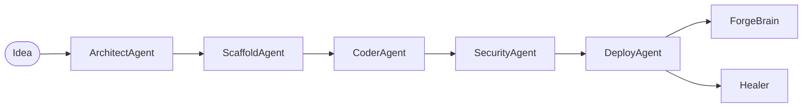

# ForgeOS

ForgeOS is a fully autonomous, multi-agent product factory. You give it a
single English idea; it returns a built, tested, secured, and deployed
software product.

```bash
git clone <this-repo>
cd forgeos
pip install -e .[all]
cp .env.example .env  # fill in keys
python -m forgeos.orchestrator --idea "Build a SaaS that turns voice notes into tasks"
```

## Architecture

Five specialised agents run in sequence, sharing a single
`ProjectContext` written to disk after every step:



- **ArchitectAgent** — picks the stack, writes `SPEC.md`, `ARCH.md`, `STACK.json`, `TASKS.json`.
- **ScaffoldAgent** — emits the full project tree (Next.js + FastAPI + Supabase by default).
- **CoderAgent** — implements every coder-tagged task, writes tests, self-reviews each file.
- **SecurityAgent** — runs an OWASP audit, writes `SECURITY.md`, refines RLS policies.
- **DeployAgent** — creates GitHub repo, deploys to Railway + Vercel, configures monitoring.

After each successful build, **ForgeBrain** distils patterns into your
Obsidian vault. **Healer** runs as a daemon, watching Sentry and Uptime
Robot to auto-PR fixes.

## Files

| Path | Purpose |
| ---- | ------- |
| `forgeos/orchestrator.py` | Main entry point. |
| `forgeos/forge_brain.py` | Obsidian knowledge accumulation. |
| `forgeos/healer.py` | Self-healing daemon. |
| `forgeos/agents/` | Agent implementations. |
| `forgeos/llm/` | Claude / DeepSeek / Ollama clients with router. |
| `forgeos/tools/` | GitHub, Railway, Vercel, Supabase, Sentry, Uptime Robot clients. |
| `forgeos/templates/` | Jinja2 templates for boilerplate. |

## Configuration

All credentials come from environment variables (or `.env`). See
`.env.example` for the full list. ForgeOS will degrade gracefully when
optional providers are missing — e.g. it will still produce code and a
report even without `RAILWAY_TOKEN`, just skipping the deploy step.

## LLM routing

```python
def route(task_complexity, task_type):
    if task_complexity == "hard" or task_type == "architecture":
        return ClaudeClient(model="claude-sonnet-4-20250514")
    elif task_complexity == "medium" or task_type in ("review", "security"):
        return DeepSeekClient(model="deepseek-v3", via="openrouter")
    else:
        return OllamaClient(model="qwen3-coder-next")
```

The router automatically falls through the chain on errors / missing
keys, so a single configured provider is enough to run end-to-end.

## Tests

```bash
pip install -e .[dev]
pytest
```

The suite uses no real network calls — agents fall back to deterministic
templates when no LLM is configured.

## License

MIT.
