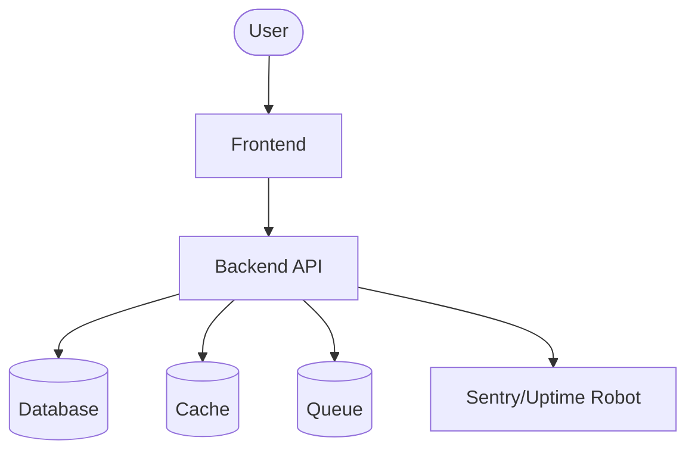

# ContractForge — AI contract and proposal generator for Indian freelancers. GST-compliant contracts, NDA templates, SOW generation. PDF export with e-signature flow. INR pricing at Rs2499/month via Lemon Squeezy. Next.js 14 + FastAPI + Supabase.

## Stack

- **frontend**: Next.js 14 (App Router) + Tailwind + Shadcn/ui
- **backend**: FastAPI
- **database**: Supabase (Postgres)
- **cache**: Upstash Redis
- **queue**: Upstash Kafka
- **auth**: Supabase Auth
- **payments**: Lemon Squeezy
- **email**: Resend
- **monitoring**: Sentry + Uptime Robot
- **ci_cd**: GitHub Actions
- **deployment**: Railway (backend) + Vercel (frontend)

## Architecture



## Local development

```bash
cp .env.example .env
docker compose up --build
```

Backend → http://localhost:8000
Frontend → http://localhost:3000

## Tests

```bash
pip install -e .[dev]
pytest
cd frontend && npm test
```
